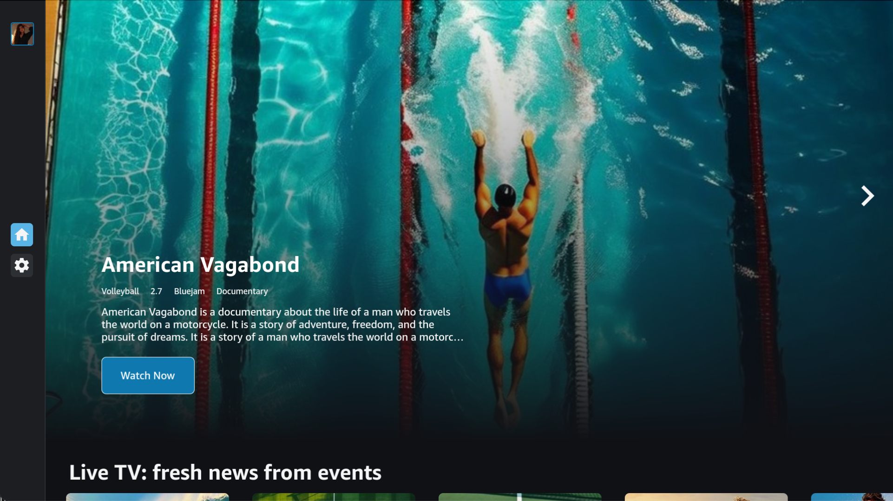

Vega Sports Sample App
========================

The Vega Sports Sample App demonstrates how to build a sports streaming application with TV-optimized interfaces and video playback functionality.




Introduction
------------


### Key features

- Home page layout with hero carousels and sports category sections.
- Content detail pages for live streams, teams, and documentaries.
- Video player integration with Shaka Player for HLS/DASH streaming.
- User authentication and profile management.
- TV-optimized drawer navigation, focus management, and remote control.
- Practical examples of video controls and playback resume functionality.
- Language selection and internationalization.

**Note**: While this app contains recommendations, there are always different approaches to building components, screens, or using libraries. This guide serves as a starting point for what needs to be done, but we encourage you to explore and adopt best practices that suit your specific project requirements.


Build and run the app
--------------------

### Prerequisites

Before you launch the sample app, make sure that you have:

1. [Installed the Vega Developer Tools](https://developer.amazon.com/docs/vega/0.21/install-vega-sdk.html)
2. **Java Runtime Environment (JRE) or Java Development Kit (JDK)** - Required by Shaka Player's build system for JavaScript compilation and optimization
3. **Python** - Required by Shaka Player's build scripts

**Note**: The Shaka Player integration runs automatically during `npm install` and requires these dependencies. If you encounter build errors related to Java or Python, install the missing prerequisites and run `npm install` again. For any other prerequisite Shaka issue please visit: https://shaka-project.github.io/shaka-player/docs/api/tutorial-welcome.html.


### Step 1: Build the app

After you download the source code from GitHub, you can build the Vega Sports Sample App from the command line to generate VPKG files. The VPKG files run on the Vega Virtual Device and Vega OS Fire TV Stick.

You can also use [Vega Studio](https://developer.amazon.com/docs/vega/0.21/setup-extension.html#learn-the-basic-features) with Visual Studio Code to build the app.

1. At the command prompt, navigate to the Vega Sports Sample App source code directory. 

2. To install the app dependencies, run the following command. 

   ```
   npm install
   ```

3. To build the app to generate .vpkg files, run the following command.

   ```
   npm run build:app
   ```

4. At the command prompt, in the **build** folder, verify that you generated the VPKG files for your device's architecture.

   * **armv7-release/keplersportapp_armv7.vpkg**&mdash;generated on x86_64 and Mac-M series devices to run on the Vega OS Fire TV Stick.
   * **x86_64-release/keplersportapp_x86_64.vpkg**&mdash;generated on x86_64 device to run on the VVD.
   * **aarch64-release/keplersportapp_aarch64.vpkg**&mdash;generated on Mac M-series device to run on the VVD.
   
### Step 2: Run the app

#### Vega Virtual Device

1. To start the Vega Virtual Device, at the command prompt, run the following command.

   ```
   kepler virtual-device start
   ```

2. Go to the directory where you placed the VPKG files. 

3. To install and launch the app on the Vega Virtual Device, run the following command, depending on your device architecture.

   - On Mac M-series based devices. 
      
      ```
      kepler run-kepler build/aarch64-release/keplersportapp_aarch64.vpkg
      ```

   - On x86_64 based devices.
      
     ```
     kepler run-kepler build/x86_64-release/keplersportapp_x86_64.vpkg
     ```  

#### Vega OS Fire TV Stick

1. Turn on your Vega OS Fire TV Stick.

2. To install and launch the app on your Vega OS Fire TV Stick, run the following command.

   ```
   kepler run-kepler build/armv7-release/keplersportapp_armv7.vpkg
   ```


API module and DTO pattern
--------------------------

The API module, located in `src/api`, is responsible for handling data fetching, parsing, and error management across supported endpoints. The API module follows the **DTO (Data Transfer Object) pattern**, which standardizes data received from the server, ensuring it's transformed into consistent app models that live in the `src/models` folder, which defines the object shapes expected by the app. This approach helps maintain clear type definitions, reliable data structures, and centralized error handling.

Refer to the [API README](./src/api/README.md) for full implementation details, usage examples, and guidance on adding new endpoints.

Services
--------

The Sports app is structured to delegate specific tasks to encapsulated units of logic known as services. Each service is designed to handle a particular functionality, allowing for clean separation of concerns and ensuring that the logic is reusable and maintainable. This approach makes services to be potentially extracted for use in other applications with ease.

- [**AppConfig Service**](./src/services/appConfig/README.md): Manages environment variables defined in the `.env` file, enabling the app to read and apply configuration settings.

- [**ApiClient Service**](./src/services/apiClient/README.md): Manages fetching data from various data sources exposing common API for different clients that can be consumed across the app especially in fetchers implemented in `src/api` folder.

- [**DeviceInfo Service**](./src/services/deviceInfo/README.md): Provides access to device-specific information, such as determining the type of device, and interacts with device-related APIs.

- [**DeviceStorage Service**](./src/services/storage/README.md): Provides access to device storage, by abstracting storage related APIs exposed by `AsyncStorage`.

- [**NetInfo Service**](./src/services/netInfo/README.md): Monitors internet connectivity, manages the network state, and listens for network-related events.

- [**Auth Service**](./src/services/auth/README.md): Manages user authentication, including signing users in and out, and restoring session data from device storage.

- [**i18n Service**](./src/services/i18n/README.md): Provides methods to manage translations in the app.

- [**Focus Guide Service**](./src/services/focusGuide/README.md): Provides hooks and wrappers to manage focusing elements in the app.

- [**Accessibility (a11y) Service**](./src/services/a11y/README.md): Provides common logic for applying complex accessibility properties to components.


Shaka Player Integration
------------------------

This app integrates a customized version of Shaka Player for video streaming functionality. The integration process is automated through the `postinstall` script and involves several steps:

### Installation Process

When you run `npm install`, the following automated process occurs:

1. **Patch Application**: `npx patch-package` applies any local patches to dependencies
2. **Shaka Player Setup**: The `shaka-setup/build.sh` script executes:
   - Clones the official [Shaka Player repository](https://github.com/shaka-project/shaka-player.git) from GitHub
   - Checks out the specified version and creates a corresponding branch
   - Extracts the custom tarball containing:
     - **Custom patches** for Vega TV platform compatibility
     - **Polyfills** for W3C Media APIs
     - **Custom source files** optimized for TV environments
   - Applies all patches using `git am` to modify Shaka Player for TV platform support
   - Builds the customized Shaka Player using the Vega build system
   - Adds `// @ts-nocheck` to TypeScript files to prevent linting issues
3. **File Distribution**: The `shaka-setup/copyOutputs.sh` script:
   - Copies the built Shaka Player files to `src/w3cmedia/shakaplayer/`
   - Copies custom source files and polyfills to `src/w3cmedia/`
   - Removes obsolete files that could cause build issues

### Custom Patches Overview

The tarball includes custom patches that provide:
- **Dolby Audio Support** for enhanced audio experiences.
- **Performance Optimizations** for TV hardware.
- **W3C Media API Compatibility** for Vega platform.
- **Bug Fixes** for HLS/DASH playback on TV devices.
- **Custom Event Handling** for TV-specific interactions.

The Shaka Player integration is essential for video playback functionality. The custom patches ensure optimal performance and compatibility with Vega TV platform requirements.


Customize the Sports app
------------------------

### Connect the app to your backend

The following steps show how to configure the API client and set up data related components to fit to your backend.

To learn more about creating API fetchers, see the [API README](./src/api/README.md). To learn more about all options and technical background for the API client, see the [API Client README](./src/services/apiClient/README.md). 

#### Configure the API client

1. To copy the **.env.example** file and name it **.env**, run the following command.

   ```
   cp .env.example .env
   ```
  
2. Update the `REACT_APP_API_KEY` variable with your backend URL, for example, `REACT_APP_API_KEY=https://exampleapi.com/`.
3. To apply the new configuration, stop the metro server, and start the metro server again.


#### Data flow

Some of the screens in the Sports app have a configurable layout. You can create your preferred screen layout for a specific screen. 

To standardize transfer information form your backend to the app, the DTO (Data Transfer Object) pattern is used. The ***DTO.ts** files contain a definition of your backend response and parsing functions to transition object keys to the Amazon models.

#### Adjust the Home screen of the app

The `Home`component in the **Home.tsx** file is the Home screen view for the app, and is composed of a few carousels. The configuration for the Home screen is returned from the `useCarouselLayout` hook in the [**fetchCarouselLayout.ts**](./src/api/carouselLayout/fetchCarouselLayout.ts) file. 

The `useCarouselLayout` hook in the [**fetchCarouselLayout.ts**](./src/api/carouselLayout/fetchCarouselLayout.ts) file returns the following array of objects: 

* `itemId` - (required) ID to identify configuration .
* `carouselType` - (required) Type of carousel that affects visual styles. The available types include hero, square, and card .
* `carouselTitle` - (optional) Custom title displayed above the carousel.
* `endpoint` - Endpoint to fetch data.

##### Set up the configuration

1. To set a proper endpoint that corresponds with your backend, change a value for `CarouselLayout` in the [**types.ts**](./src/services/apiClient/types.ts) file.

2. Modify the DTO definition and parser methods to fit your backend in the [**CarouselLayoutDto.ts**](./src/api/carouselLayout/dtos/CarouselLayoutDto.ts) file.

#### Add a new fetcher

Make sure that all endpoints from the [**types.ts**](./src/services/apiClient/types.ts) file follows the backend setup. Instead of creating new fetchers, you can edit an existing fetcher.

1. Define the DTO and parsing logic.

   The data transfer object is defined in the **liveStreams/dtos/LiveStreamsDto.ts** file.

   ```typescript
   export type LiveStreamDto = {
      id?: string;
      title?: string;
      description?: string;
      streamUrl?: string;
      observers_count?: number;
      start_time?: string;
   };

   export function parseLiveStreamsDtoArray(
      data: LiveStreamDto[],
   ): LiveStreamModel[] {
      return data.map((dto) => ({
         id: dto.id,
         title: dto.title,
         description: dto.description,
         url: dto.streamUrl,
         viewers: parseNumber(dto.observers_count),
         startTime: new Date(dto.start_time),
      }));
   }
   ```

2. Define the Model type.

   In `src/models/liveStreams`, define the data model object. This is the final Model structure, so you must be sure about what value has to be here and its type is properly parsed in Step 1.

   After the data has been transformed from the Data Type Object (properties are optional) into the Data Model Object (properties are required), any code that subsequently uses this data can rely on these properties being present and correctly typed. This provides confidence when working with the data later in the app flow and creates a more reliable and maintainable codebase where TypeScript can provide better type safety and IDE support.

   ```typescript
   export type LiveStreamModel = {
      id: string;
      title: string;
      description: string;
      streamUrl: string;
      viewers: number;
      startTime: Date;
   };

   export function parseLiveStreamsDtoArray(
     data: LiveStreamDto[],
   ): LiveStreamModel[] {
     return data.map((dto) => ({
       id: dto.id,
       title: dto.title,
       description: dto.description,
       url: dto.streamUrl,
       startTime: new Date(dto.startTime),
     }));
   }
   ```

3. Implement the Fetch function.

   The **fetchLiveStreams.ts** file includes the combination of API fetch, error handling, and parsing functionality.

   ```typescript
   import {
     ApiClient,
     isSuccessResponse,
     Endpoints,
   } from '@AppServices/apiClient';
   import { parseLiveStreamsDtoArray, LiveStreamDto } from './dtos/LiveStreamsDto';
   import staticData from './staticData/liveStreams.json';

   type ResponseDto = LiveStreamDto[];

   const endpoint = Endpoints.LiveStreams;

   export const fetchLiveStreamsApiCall = async () => {
     const response = await ApiClient.get<ResponseDto>(
       endpoint,
       { staticData },
       { isAuthorized: true },
     );

     if (!isSuccessResponse(response)) {
       switch (response.status) {
         case 400:
           throw new Error(
             `fetchLiveStreamsApiCall(): Resource does not exist for endpoint '${endpoint}'`,
           );
         default:
           throw new Error(
             `fetchLiveStreamsApiCall(): Failed to fetch data from endpoint '${endpoint}'`,
           );
       }
     }

     return parseLiveStreamsDtoArray(response.data);
   };
   ```

4. Create the custom hook.

   In the **fetchLiveStreams.ts** file, use `SWR` to create a dedicated reusable hook for a given endpoint.

   ```typescript
   import useSWR from 'swr';

   export const useLiveStreams = () => {
     const { data, error, isLoading } = useSWR(endpoint, fetchLiveStreamsApiCall);

     return {
       liveStreams: data,
       isLoading,
       isError: error,
     };
   };
   ```   

#### Example: Usage of the hook

Use `useLiveStreams` within a component to fetch and consume live stream related data.

```typescript
import React from 'react';
import { useLiveStreams } from '@AppServices/api/liveStreams/fetchLiveStreams';

export const LiveStreamsList = () => {
  const { liveStreams, isLoading, isError } = useLiveStreams();

  if (isLoading) return <Text>Loading...</Text>;
  if (isError) return <Text>Error loading streams.</Text>;

  return (
    <View>
      {liveStreams.map((stream) => (
        <View key={stream.id}>{stream.title}</View>
      ))}
    </View>
  );
};
```

### Customize the theme of the app

You can customize the color scheme and font settings.

#### Set up the color scheme 

1. Create a color scheme that your prefer. You can use a color scheme generator, for example, [Material Design](https://material-foundation.github.io/material-theme-builder/).

2. Export the theme that you created as a JSON file.

3. Go to the [**palette.ts**](./src/theme/palette.ts) file and replace `lightPalette` & `darkPalette` objects with the generated objects that you created.

4. Add additional custom colors.

   * `transparent` - Use this option if you want to prevent transparent colors from being used in your app theme. For example, if you set `backgroundColor` to `transparent`, an error occurs. 
   * `focusPrimary` - Colors used for highlight focused element.
   * `gradientPrimary` - Definition of gradient color displayed as a background. 
    
     Example:

     ```js
     transparent: 'transparent',
     focusPrimary: '#FDE8C7',
     gradientPrimary: ['rgba(255, 255, 255, 0)', 'rgba(255, 255, 255, 0.8)'],
     ```


5. To view the updated theme, reload the app.

#### Set up components UI

You can customize font sizes, colors, and spaces for particular components.

1. Go to the **tokens** (./src/theme/tokens) directory.

2. Edit any values to suit your needs.

3. To view the updated components, reload the app.

### Customize the dynamic layout of the app 

The Details screen and Home screen carousels in the app are composed of two key elements: **layout** and **data**. Both of these elements can be fetched from your backend and work together to render the screen dynamically.

#### Layout

##### Home screen carousels layout

The layout of the carousels includes information about carousel type, data type to be displayed in the given carousel, and the carousel title. These layouts are provided as static JSON files (../src/api/carouselLayout/staticData/carouselLayout.json).

Home screen carousels can use one of three types: Hero, Square, or Card. Each type has a different visual style and layout.

##### Details screen layout

The Details screen layout determines the structure and visual arrangement of the Details screen. It is defined by a JSON file that can be managed through a backend or CMS. This JSON file specifies the components to use and their arrangement. The available components include the following:

* **Container**: Defines a section or grouping of components.

* **Image**: Displays an image within the layout.

* **Text**: Shows textual content, such as titles or descriptions.

The layout can be configured by your backend or CMS team, offering flexibility to structure and manage different content types effectively. These layouts are provided as static JSON files (../src/api/detailsLayout/staticData/detailsLayout.json).

Example static JSON files:

* **Documentaries**: The layout might include two text components at the top followed by an image.

* **Teams**: The layout might feature a container with text and an image side by side.

* **LiveStreams**: A layout optimized for showcasing live video content.

Each layout can be tailored to the content type it represents and provides instructions for how the screen should be visually structured.

#### Data

##### Home Screen Carousels Data

The data represents the content to be displayed in the carousels on the Home screen. It can be of one of 4 types: live streams, documentaries, teams, or "suggested for you".

##### Details screen data

The data represents the specific content to be displayed on the Details screen. The data includes the following:

* Titles

* Descriptions

* Images

* Any other content-specific details

The app fetches the layout JSON file from the backend, and then combines it with the data for the specific content type to render the screen. For example, if the backend sets a layout for documentaries to include two text components and an image, the app completes the following:

1. Parse the layout JSON file to understand the structure.

2. Fetch the documentary-specific data (for example, title, description, image URL).

3. Render the layout with the fetched data, displaying the title and description in the text components and the image in the image component.

##### Dynamic data

1. Reference external layout contents.

   To reference existing layout contents from a different endpoint, the `linked_content` property can be used. An example for this feature in the codebase exists: [**suggestedForYou.json**](./src/api/suggestedForYou/staticData/suggestedForYou.json) items display actual layout and contents of the [**liveStreams.json**](./src/api/liveStreams/staticData/liveStreams.json) file.

   ```json
   [
       // ...
       "suggestedforyou": [
       {
           "show_name": "American Vagabond",
           "id": "e9a06a8f-9d40-41b9-a8b4-38bbc67159a2",
           // ...
           "linked_content": {
               "endpoint": "livestreams",
               "itemId": "50128bae-e954-4233-8e15-cd5867a31370"
           }
       },
       // ...
   }
   ```

   The `linked_content` property must specify the `endpoint` from which to fetch the data and the `itemID` referencing an `id` from a different endpoint. The referenced item from the [`livestreams`](./src/api/liveStreams/staticData/liveStreams.json) endpoint looks as follows:

   ```json
   {
       "id": "50128bae-e954-4233-8e15-cd5867a31370",
       "stream_date": "...",
       "title": "...",
       "thumbnail": "..."
   },
   ```

2. Display dynamic content using `DCText`.

   With the `DCText` element type, you can display dynamic text in the layout. The `text` property includes the dynamic text. The path might be nested, such as `team.trainer.firstName`.

   A layout example can be found in the [**detailsLayout.json**](./src/api/detailsLayout/staticData/detailsLayout.json) file for `"layout_type": "teams"`.

    
   `DCText` element type example:
 
  
   ```json
   {
      "elementType": "DCText",
      "text": "Athlete stories provide an insight into the lives of sports stars beyond the game. They highlight the challenges, sacrifices, and triumphs that shape their journeys to success. From overcoming injuries to breaking records, these stories inspire fans and aspiring athletes alike. They often reveal the personal struggles and resilience that drive their passion for the sport. Athlete stories also celebrate their achievements, both on and off the field, showcasing their impact on the community. Through these narratives, we connect with the human side of sports, finding motivation and admiration in their experiences.",
      "displayProps": {
      "variant": "body",
      "alignContent": "center",
      "alignItems": "center",
      "justifyContent": "center"
      },
      "id": "container-body1"
   }
   ```

3. Display images using `DCImage`.

   **Example: Dynamic image source**

      The `DCImage` component allows for displaying images from dynamic URL sources using the `targetUrl` property. `DCImage` must specify the path to the **parsed** item property that includes the URL to the image value. The path might be nested, such as `team1.thumbnail`.

      An example can be found in the [**detailsLayout.json**](./src/api/detailsLayout/staticData/detailsLayout.json) file for `"layout_type": "livestreams"` that references the `team1.thumbnail` property of a `livestreams` endpoint item:

      ```json
      // ...
      {
          "id": "livestreams",
          "layout_type": "livestreams",
          // ...
          "layoutElements": [
              {
              "layoutElements": [
                  {
                  "id": "containerlivestreams-imagetile1",
                  "elementType": "DCImageTile",
                  "image": {
                      "targetUrl": "team1.thumbnail"
                  },
                  // ...
                  },
                  // ...
              },
              // ...
          ]
      },
      // ...
      ```

   

   **Example: Dynamic image title**

      The `DCImage` component allows for dynamic image titles from dynamic URL sources using the `titleTarget` property. `DCImage` must specify the path to the **parsed** item property that includes the URL to the image title. The path might be nested, such as `team1.teamName`.

      An example can be found in the [**detailsLayout.json**](./src/api/detailsLayout/staticData/detailsLayout.json) file for `"layout_type": "livestreams"` that references the `team1.name` property of a `livestreams` endpoint item:


      ```json
      // ...
      {
          "id": "livestreams",
          "layout_type": "livestreams",
          // ...
          "layoutElements": [
              {
              "layoutElements": [
                  {
                  "id": "containerlivestreams-imagetile1",
                  "titleTarget": "team1.name",
                  "elementType": "DCImageTile"
                  // ...
                  },
                  // ...
              },
              // ...
          ]
      },
      // ...
      ```
     

#### Backend Configuration

The backend team or CMS manager is responsible for setting the appropriate layout for each content type. By defining these layouts in JSON, they control how each type of content appears in the app, ensuring consistency and flexibility across various screens.

**Example JSON**

You can find the minimum product implementation of the Details screen JSON files in the [**detailsLayout.json**](./src/api/detailsLayout/staticData/detailsLayout.json).

**Customizing dynamic layout**

If you decide to use the dynamic layout, as it is configured in the Sports app, you are free to use any type of backend or CMS you wish. The only constraint from the point of view of the app is the shape of JSON files, which are expected by the Home screen carousels and Details screen.

You can familiarize yourself with what is expected from the backend by looking at the data models placed in the [**CarouselLayout.ts**](./src/models/carouselLayout/CarouselLayout.ts) file and the [**DetailsLayout.ts**](./src/models/detailsLayout/DetailsLayout.ts) file.


### Change the language of the app

You can change the existing app language to any language in the language list using the i18n service. To learn more about the i18n service, see the [README](./src/services/i18n/README.md).

#### Language list

All available languages are defined in the [**languages.ts**](./src/services/i18n/languages.ts) file.

```js
export const languages = [
  { key: 'en-US', label: 'english' },
  { key: 'pl', label: 'polish' },
] as const;

```

All items must correspond with directories in the `assets/text` directory.

#### Change existing languages

All languages are located in `assets/text` directory, that follows this structure:

```
assets
└── text
├── en-US
│   └── strings.puff.json
├── pl
│   └── strings.puff.json
└── es
    └── strings.puff.json

```


To change the translated text displayed in the app, change the values in the applicable files. If you are adding a new key/value pair, you can start by changing only one file, for example **assets/en-US/strings.puff.json**. Then, to synchronize all files, at the command prompt run the following script:

```
npm run i18n:sync
```


After running the above script you will need to manually update every JSON file to contain correct translations.
If you prefer, you can skip using the above script and update every .puff.json  file present in the app manually. 

#### Add new languages

1. In the **assets/en-US/** directory, open the default language file, **strings.puff.json**.

2. Add your preferred languages.

3. To copy created keys to other language files, at the command prompt, run the following command. 

   ```
   npm run i18n:sync
   ```

4. Adjust values of new keys to particular language.

## Accessibility

The VegaSportsApp implements comprehensive accessibility features to ensure the app is usable by everyone, including users with disabilities. The app follows TV accessibility best practices and provides screen reader support.

For more information about the specifics of Accessibility for Vega, check the [A11Y API](https://developer.amazon.com/docs/react-native-vega/0.72/accessibility.html) documentation.

### Accessibility Service

The app uses a dedicated [Accessibility Service](../../src/services/a11y/README.md) that provides utilities for complex navigation scenarios and screen reader integration.

### Core Utilities

#### Screen Reader Detection
```typescript
import { useScreenReaderEnabled } from '@AppServices/a11y';

const screenReaderEnabled = useScreenReaderEnabled();
```

#### Navigation Hints
For lists and carousels, the service automatically generates navigation hints:
```typescript
import { injectListNavigationHints } from '@AppServices/a11y';

{injectListNavigationHints(items, {
  directionLabels: { previous: 'up', next: 'down' },
  formatOtherItemNavigationHint: ({ item, direction }) => 
    `Use ${direction} to go to ${item.label}`
}).map(({ item, hints }) => (
  <Component 
    key={item.id}
    accessibilityHint={hints.join(' ')}
    {...item} 
  />
))}
```

#### Conditional Hints
The `HintBuilder` class allows building complex, conditional accessibility hints:
```typescript
import { HintBuilder } from '@AppServices/a11y';

accessibilityHint={new HintBuilder()
  .appendHint('Press to select', true)
  .appendHint('First item', { type: 'first-item', index })
  .appendHint('Last item', { type: 'last-item', index, length })
  .asString(' ')}
```

## Implementation Guidelines

### Labels and Hints
- All interactive elements have meaningful `ariaLabel` properties
- Navigation hints are provided for complex layouts like carousels
- Dynamic content includes contextual accessibility information

### Translation Integration

Accessibility labels and hints support internationalization through the [i18n service](../../src/services/i18n/README.md). All accessibility strings are translatable and follow the same localization patterns as other app content.


### Splash screen
 
**For comprehensive implementation guidance**, developers should refer to the detailed [Splash Screen Manager documentation](https://developer.amazon.com/docs/react-native-vega/0.72/splashscreenmanager.html) which covers API usage, lifecycle management, asset optimization, and platform-specific considerations for creating engaging splash screen experiences on Fire TV.

#### Splash screen assets structure
 
```
/assets/raw/SplashScreenImages.zip
├── _loop/
│   ├── loop00000.png
│   ├── loop00001.png
│   ├── loop00002.png
│   ├── loop00003.png
│   ├── loop00004.png
│   └── loop00005.png
└── desc.txt
```
 
The `SplashScreenImages.zip` contains images from the `SplashScreenImages` folder. Individual assets are available in `assets/raw/SplashScreenImages/` for reference. Only the ZIP file is required for implementation.


Testing the app
---------------

We use [React Native Testing Library (RNTL)](https://callstack.github.io/react-native-testing-library/) for component and integration testing in this project. RNTL provides a robust set of tools for testing React Native applications with a focus on user interactions and accessibility.

### React Native Testing Library (RNTL)

RNTL allows us to write tests that closely resemble how users interact with our app. It provides utilities for rendering components, finding elements, and simulating user actions.

### Test commands

To run the test suite, use the following commands.

```
npm test
```

Run tests in watch mode:

```
npm run test:watch
```

For more detailed information about our testing set up, best practices, and custom utilities, please refer to the [testing documentation](./src/test-utils/README.md) in the test-utils directory.


Performance testing
-------------------

### Set up testing

For performance testing, the example test scenarios have been set up in `kpi-test-scenarios` folder.

### Assessment

Before running tests, run `npm run build:e2e` to make sure the app is built properly in the `test` babel environment so that the `.env.e2e` file is used instead of `.env`. This is needed, for example, to force the login screen to appear and make sure the initial state of the app is what the tests would expect.

Afterwards, install and run the `Release` variant using `npm run kepler:run:aarch64:release`. Please keep in mind that _only_ the `Release` variant is suitable to obtain valid performance metrics.

Troubleshooting the app
-----------------------

If you're facing unexpected issues while trying to build and run the app (the build is failing randomly, the app is not starting, the app is crashing randomly, etc.), try the following solutions:

1. Run `npm run clean` -> this command removes `node_modules` folder and other files related to your previous builds.

2. When working in debug mode you may need to use `npm run start -- --reset-cache` to clear the cache.

3. In some cases (changes done to patches, changes in package.json, etc.) you may need to make sure there is no cache present in the project, in order to build successfully. Cleaning ALL cache files in the project can be done by running the following commands:

   ```
   npm run clean
   npm cache clean --force
   watchman watch-del-all
   rm -fr $TMPDIR/haste-map-*
   rm -rf $TMPDIR/metro-cache

   npm install
   npm start -- --reset-cache
   ```

You can read more about those commands in the Expo documentation [here](https://docs.expo.dev/workflow/customizing/#clearing-cache).

4. Restart the Vega Virtual Device -> we have observed the VVD crashing randomly if it's used without restarting for extended periods of time.

5. Run `kepler clean` -> removes the artifacts generated in the top level `/.build` folder (documentation [here](https://developer.amazon.com/docs/vega/0.21/cli-tools.html)).


Release notes
-------------

---

### v0.22

#### Video Asset Infrastructure Migration

* **Infrastructure Migration** - Migrated all video assets from external demo URLs to unified CloudFront CDN (`d1v0fxmwkpxbrg.cloudfront.net`).
  - Replaced external demo assets with new videos infrastructure.
  - Improved reliability and performance for video streaming across all content types.

* **Format Standardization** - Standardized video source formats across the application
  - **HLS Streams**: Consistent `.m3u8` video content with proper HLS labeling.
  - **DASH Streams**: Unified `.mpd` manifest format with DASH type identification.
  - **MP4 Videos**: Direct `.mp4` file access for progressive download content.

* **Thumbnail Support** - Added `thumbnailUrl` properties to all video sources:
  - Integrated trickplay thumbnail support for video scrubbing and preview functionality.
  - Consistent thumbnail URL structure across all video formats.

#### Headless Video Player Implementation

* **NEW: Headless Video Player Architecture** - Introduced a complete headless video player system that runs on a separate JavaScript thread for improved performance and UI responsiveness.
  - `HeadlessVideoPlayerService`: Core service managing video playback in headless mode.
  - `HeadlessVideoPlayerClient`: Client-side wrapper providing VideoPlayerService-compatible interface.
  - `useHeadlessVideoPlayer` and `useHeadlessVideoPlayerWithSettings` hooks for React integration.

* **NEW: Smart Video Player Selection** - Added intelligent player selection system via `VideoPlayerSelector`
  - Automatically chooses between regular and headless video players based on:
    - Device capabilities (TV platform support, memory requirements).
    - Content type (live streams vs VOD content).  
    - User configuration preferences.
  - Configurable thresholds for memory requirements (default: 2GB for headless).
  - Content-specific enablement (headless enabled for live streams by default, disabled for VOD).

* **NEW: Hybrid Video Player Hook** - Introduced `useSmartVideoPlayer` that seamlessly switches between player implementations.
  - Automatic fallback to regular player if headless initialization fails.
  - Maintains consistent API across both player types.
  - Real-time availability checking and recommendations.

#### Enhanced Video Player Integration

* **Performance Improvements** - Headless implementation provides:
  - Improved Time to First Video Frame (TTFVF).
  - Better UI responsiveness during video operations.
  - Reduced main thread blocking during video processing.

* **Advanced Features** - Headless player supports:
  - Full HLS/DASH streaming via Shaka Player integration.
  - Audio, video, and text track management.
  - Buffered ranges and status reporting.
  - Surface handle management for video rendering.
  - Caption view handling for subtitles.
  - Playback rate control and seeking operations.
  - Volume and mute state management.

#### Technical Infrastructure

* **Thread Separation** - Video processing moved to dedicated JavaScript thread.
* **IPlayerServer/IPlayerClient Communication** - Standardized message passing between UI and headless service.
* **W3C Media API Integration** - Full compatibility with existing W3C Media standards.
* **Type Safety** - Complete TypeScript definitions for all headless components.
* **Comprehensive Testing** - Full test coverage for headless player components and selectors.

#### Developer Experience

* **Backward Compatibility** - Existing VideoPlayerService implementations remain unchanged.
* **Configuration Options** - Extensive configuration for fine-tuning headless behavior:
  ```typescript
  {
    enableHeadless: true,
    minMemoryForHeadless: 2048,
    enableHeadlessForLiveStreams: true,
    enableHeadlessForVOD: false,
    forcePlayerType?: VideoPlayerType
  }
  ```
* **Debug Support** - Comprehensive logging for troubleshooting player selection and headless operations..


---

### v0.21

* Initial release.

---

#### ⚠️ Known Issues

* **Debug Build Crash with Headless Player** - When `useHeadless={true}` is enabled, the debug version of the app may crash during video playback. This is a known issue that will be resolved in the upcoming SDK 0.22 release. For development purposes, use the release build when testing headless functionality or keep `useHeadless={false}` for debug builds.

**Note**: Headless functionality is currently disabled by default in VideoPlayerScreen (`useHeadless={false}`) but can be enabled through the smart player selection system or direct configuration.

License
-------

See [LICENSE](LICENSE) file.
